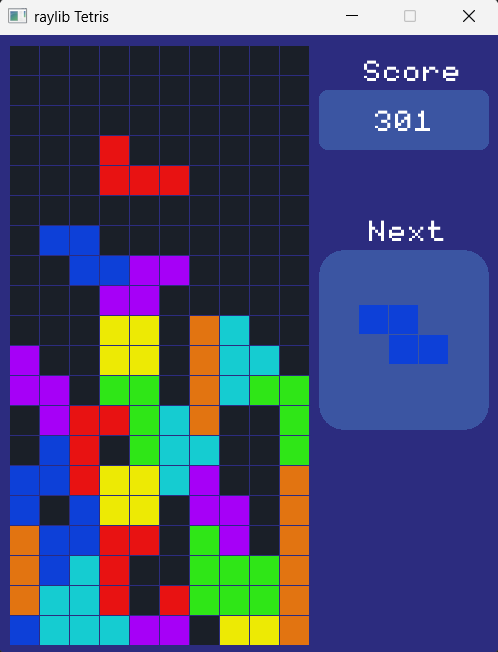

## Tetris game using raylib library
Game is made in c++ with **raylib** library that uses OpenGL in background. It is well suited for game development on lower level but at the same time abstracts raw OpenGL api.

## How to run
Project is currenly supported for windows visual studio.
### Recommended approach
1) install vcpkg package manager for managing libraries on windows: [quick youtube tutorial](https://youtu.be/0h1lC3QHLHU?si=1Y38M3zK9OY3GYae) - note: vcpkg directory gets large, choose path like C:\vcpkg\
2) open system environment variables so we can set vcpkg variable and use vcpkg anywhere in the system
3) add new user variable: `VCPKG_ROOT` and set value to path of vcpkg root directory in which vcpkg.exe is located.
4) add that same path to: **system** variables >> path
5) run `vcpkg install raylib`
6) open visual studio solution and run the project

another quick tutorial: [youtube tutorial](https://www.youtube.com/watch?v=UiZGTIYld1M&t)

### Alternitive approach

1) download raylib for visual studio (msvc16): [github releases](https://github.com/raysan5/raylib/releases/tag/5.5)
2) extract files. You will see includes and lib directories inside
3) open visual studio solution
4) go to project>>properties>>C/C++>>general>>additional include directories and add path to`include`
5) do the same for additional library directories and add path to raylib `lib`
6) now go to project>>properties>>linker>>additional dependencies and add `raylib.lib;winmm.lib`
7) run the project

3 minute youtube tutorial: [quick tutorial](https://youtu.be/O96m52ZxQcw?si=VJqgVixjIyaUEEUe)

#### standalone application
Instead of standard visual studio project structure, settings are modified so that final and intermediate files are inside bin directory inside solution directory. Output directory is: `$(SolutionDir)bin\$(Platform)\$(Configuration)\` and intermediate directory is `$(SolutionDir)bin\intermediates\$(Platform)\$(Configuration)\`

 After that, assets are copied with post-build command `xcopy /Y /E /I "$(ProjectDir)Assets" "$(SolutionDir)bin\$(Platform)\$(Configuration)\Assets"` so that tetris.exe becomes standalone application.

 I modified this because i think it's much more logical and organized in better way.